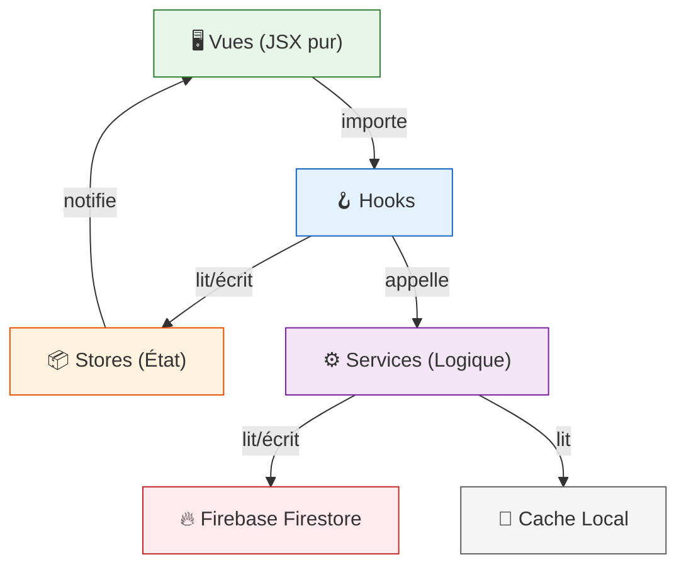

# Plan d'Architecture : Séparation Logique/Vues + Performance

## Diagnostic de l'Architecture Actuelle

Après analyse approfondie du codebase, voici les **problèmes structurels majeurs** qui impactent la performance et la maintenabilité :

### 🔴 Problèmes Critiques

| Problème | Fichier | Impact |
|---|---|---|
| **God Hook** `useAppLogic` (441 lignes) | [useAppLogic.ts](file:///c:/Users/Administrator/Documents/ECOMMERCE/FO/laine-et-deco/src/frontend/hooks/useAppLogic.ts) | Tout l'état global (cart, wishlist, auth, navigation, SEO) est dans un seul hook. **Chaque changement d'état re-rend l'app entière.** |
| **Mega-Router** `MainContent` (548 lignes) | [MainContent.tsx](file:///c:/Users/Administrator/Documents/ECOMMERCE/FO/laine-et-deco/src/frontend/components/MainContent.tsx) | Reçoit **25+ props** et les redistribue à toutes les vues. Couplage extrême. |
| **Prop Drilling massif** | `App.tsx` → `MainContent` → chaque vue | Les vues reçoivent des fonctions comme `onAddToCart`, `onNavigate`, etc. au lieu d'accéder à un contexte global. |
| **Pas de state management** | Tout le projet | Aucun store centralisé. Tout passe par `useAppLogic` → props. |
| **Vues qui appellent Firebase directement** | Chaque vue (`HomeView`, `ShopView`, etc.) | Les vues importent `useEntity`/`useProducts` et font leurs propres appels Firestore. La logique métier est mélangée au JSX. |
| **`constants.ts` monolithique** (42 KB) | [constants.ts](file:///c:/Users/Administrator/Documents/ECOMMERCE/FO/laine-et-deco/src/constants.ts) | 950+ lignes de données fallback chargées au démarrage, même si Firebase répond. |
| **Listeners temps réel partout** | `useEntity` utilise `onSnapshot` | Chaque collection Firestore a un listener actif même pour des données statiques (FAQ, blog posts, etc.). |
| **Fetching dupliqué** | `HomeView`, `ShopView`, `MainContent` | `useProducts()` et `useEntity('product')` appelés indépendamment dans 3+ composants = 3+ listeners Firestore simultanés sur la même collection. |

### 🟡 Architecture Hybride Incohérente

Le projet a **deux architectures en conflit** :

```
src/
├── domain/          ← Clean Architecture (quasi vide, seulement Product)
├── application/     ← Use Cases (seulement GetProducts)
├── infrastructure/  ← Repos (seulement ApiProductRepository)
├── presentation/    ← Contextes (DIContext, FirebaseContext) non utilisés par le frontend
├── backend/         ← Firebase config + autre structure domain/infra/app
└── frontend/        ← LE VRAI CODE : views, hooks, components, services
```

Les couches `domain/`, `application/`, `infrastructure/` au niveau `src/` ne sont utilisées que pour `Product` et ne sont **pas connectées au reste de l'app**. Le `DIContext` existe mais n'est pas branché. Le `FirebaseContext` existe mais `useAppLogic` gère l'auth indépendamment.

---

## Proposition Architecturale

### Objectif : **Architecture en Couches avec Stores Réactifs**

Approche pragmatique qui sépare logique et vues **sans tout réécrire**, en gardant Firebase comme BD :

```
src/
├── stores/              ← 🆕 État global (remplace useAppLogic)
│   ├── cartStore.ts
│   ├── authStore.ts
│   ├── wishlistStore.ts
│   ├── comparisonStore.ts
│   ├── navigationStore.ts
│   └── configStore.ts
│
├── services/            ← 🆕 Logique métier (appelée par les stores)
│   ├── firestore/
│   │   ├── entityService.ts     (← firestoreEntityService actuel)
│   │   ├── productService.ts
│   │   ├── orderService.ts
│   │   └── configService.ts
│   ├── cartService.ts
│   ├── authService.ts
│   └── searchService.ts
│
├── hooks/               ← 🆕 Hooks fins (1 hook = 1 responsabilité)
│   ├── useAuth.ts
│   ├── useCart.ts
│   ├── useProducts.ts
│   ├── useEntity.ts
│   └── useSearch.ts
│
├── views/               ← Vues existantes (INCHANGÉES pour le JSX)
│   └── ...              mais elles importent les hooks au lieu de recevoir des props
│
├── components/          ← Composants UI réutilisables (INCHANGÉS)
│   └── ...
│
├── types.ts             ← Types (INCHANGÉ)
├── constants/           ← 🆕 Données fallback splitées par domaine
│   ├── products.ts
│   ├── config.ts
│   └── index.ts
│
├── backend/             ← Firebase init (INCHANGÉ)
│   └── firebase.ts
│
└── App.tsx              ← Simplifié : providers + router
```

### Principes Clés



**Règle fondamentale** : Les vues n'importent **jamais** Firebase. Elles n'importent que des hooks.

---

## Plan d'Exécution en 5 Phases

### Phase 1 — Stores + Context API (Impact immédiat sur la performance)

Découper `useAppLogic` en **stores isolés** via React Context, pour que les re-renders soient ciblés :

| Store | Responsabilité | Re-rend qui ? |
|---|---|---|
| `AuthProvider` / `useAuth()` | User, rôle, login/logout | Seulement les composants auth-aware |
| `CartProvider` / `useCart()` | Panier, ajout, suppression, quantité | Seulement le panier et le badge cart |
| `WishlistProvider` / `useWishlist()` | Favoris | Seulement la wishlist |
| `ComparisonProvider` / `useComparison()` | Comparaison (max 3) | Seulement le comparateur |
| `ConfigProvider` / `useConfig()` | SiteConfig, thème, SEO | Seulement le layout |
| `NavigationProvider` / `useNav()` | View courante, navigation | Seulement le router |

> [!IMPORTANT]
> **Gain de performance** : Actuellement, ajouter un produit au panier re-rend toute l'app (1258 lignes de HomeView incluses). Avec des stores isolés, seuls les composants abonnés au cart re-rendent.

---

### Phase 2 — Extraction des Services

Sortir la logique métier des vues vers des services purs (fonctions, pas de React) :

- `cartService.ts` : calcul de prix, validation stock, application coupons
- `productService.ts` : filtrage, tri, recherche (actuellement dupliqué dans HomeView et ShopView)
- `orderService.ts` : création commande, suivi
- `authService.ts` : login, signup, gestion rôles

---

### Phase 3 — Optimisation Firebase

| Optimisation | Détail |
|---|---|
| **`getDoc` au lieu de `onSnapshot`** pour les données statiques | FAQ, blog posts, lookbooks, config → fetch once, cache |
| **Dédupliquer les listeners** | Un seul listener `product` au niveau du store, pas dans chaque vue |
| **Pagination Firestore** | `ShopView` charge tout (`limit(200)`) → passer à `startAfter` + curseur |
| **Cache intelligent** | Étendre le cache existant (`cacheStorage.ts`) avec un TTL par collection |
| **Lazy entity loading** | Les collections admin ne sont chargées que quand on accède au backoffice |

---

### Phase 4 — Refactoring des Vues

Les vues deviennent du **JSX pur** :

```tsx
// AVANT (ShopView reçoit 7 props + appelle useEntity directement)
export const ShopView: React.FC<ShopViewProps> = ({ 
  onAddToCart, onAddToWishlist, onQuickView, 
  onAddToComparison, onProductClick, events, initialSearchQuery 
}) => {
  const { products } = useProducts(); // ← appel Firebase direct dans la vue
  const { data: CATEGORIES } = useEntity('category'); // ← encore Firebase
  // ...800 lignes de logique + JSX mélangés
}

// APRÈS (ShopView n'a plus de props, utilise les hooks)
export const ShopView: React.FC = () => {
  const { products, isLoading } = useProducts(); // ← hook qui lit le store
  const { categories } = useCategories();         // ← hook dédié
  const { addToCart } = useCart();                 // ← du store
  const { addToWishlist } = useWishlist();         // ← du store
  const { searchQuery } = useSearch();
  // ... JSX uniquement
}
```

---

### Phase 5 — Split du constants.ts + Code Splitting

- Découper `constants.ts` (42 KB) en modules par domaine
- S'assurer que le lazy loading fonctionne correctement (il est déjà en place dans `MainContent`)
- Ajouter le prefetching des routes probables

---

## Open Questions

> [!IMPORTANT]
> **Question 1 — Zustand vs Context API ?**
> La Context API pure suffira pour votre cas (< 10 stores). Cependant, **Zustand** (3 KB) offre de meilleures performances par défaut (pas de re-render des consumers non-abonnés) et une API plus simple. Ma recommandation serait Zustand pour les stores, mais je peux aussi tout faire en Context API si vous préférez zéro dépendance supplémentaire.

> [!IMPORTANT]  
> **Question 2 — Migration progressive ou big-bang ?**
> Je recommande une **migration progressive** : on crée les stores un par un, et on migre les vues progressivement. Le code actuel continue de fonctionner pendant la transition. Cela prend plus de temps mais le risque de casser des choses est minimal. Confirmez-vous cette approche ?

> [!WARNING]
> **Question 3 — `react-router-dom` est déjà installé mais sous-utilisé**
> Actuellement, vous avez `react-router-dom` v7 mais le routing réel est géré manuellement dans `useAppLogic` (path parsing) + `MainContent` (switch sur `currentView`). Voulez-vous qu'on migre vers un vrai routing React Router (avec `<Route>`, `<Outlet>`, layouts) dans le cadre de ce refactoring ? Cela simplifierait énormément `MainContent` et `useAppLogic`.

## Résumé des Gains Attendus

| Métrique | Avant | Après |
|---|---|---|
| Re-renders par action | **App entière** | **Composant ciblé** |
| Listeners Firestore actifs | **~10 simultanés** | **3-4 max** (lazy) |
| Taille du bundle initial | `constants.ts` = 42 KB | Splitté en modules (< 5 KB chargés) |
| Lignes de `useAppLogic` | 441 | **Supprimé** (réparti en 6 stores) |
| Lignes de `MainContent` | 548 | **~50** (routing React Router) |
| Props passées aux vues | 7-25 par vue | **0** (hooks) |
| Couplage vue ↔ Firebase | Direct | **Indirect** (via services) |

## Verification Plan

### Automated Tests
- Vérifier que le build Vite passe sans erreur après chaque phase
- Tester les flows critiques : ajout panier, navigation, auth

### Manual Verification
- Comparer les temps de chargement avant/après via les DevTools Performance
- Vérifier dans l'onglet Firestore de la console Firebase que les listeners sont réduits
